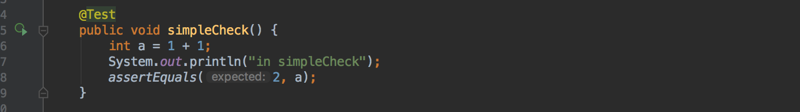
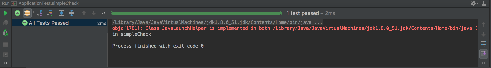
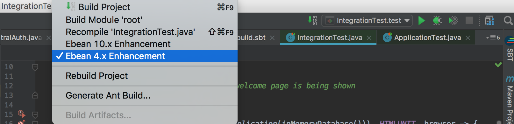

#Java 单元测试 （JUnit）

Unit Testing (单元测试）一直是开发的重中之重。其可以有效的减少bug的产生，增加开发效率，以及便于以后的复查。
这里我们只讨论在play framework 下的JUnit testing。
<br>

##Unit Testing 必须要知道的
1. 并不是写完整套功能（feature）才来补一个unit test， 而是每写完一个function 就给他写一个unit test， 检查其能否正常工作，
以及boundary case（边缘或是特殊情况）的检测。这个可以有效的减少将来潜在的bug

2. Unit test 可以帮助更好的代码设计，以及有效的减少function 的 耦合性<sup>1</sup>

3. 以后对代码更新更有保障。通过运行 test case，你可以很明确的知道，更新后的代码能否正常工作

4. 检查其他程序员是否改崩了你的代码 😂

<br>

1:耦合性越低，方法的独立性越强，那么这个方法的复用性也就越强。通常对于单元（基础）方法，耦合性越低越好

<br>

##Installation （安装）
在project 文件根目录下面找到 build.sbt, 在 libraryDependencies 中加入以下两条


```sbtshell
    libraryDependencies ++= Seq(
      .
      .
      .
      "com.typesafe.play" %% "play-test" % "2.5.14" % "test",
      "org.scalatestplus.play" %% "scalatestplus-play" % "1.5.0" % "test"
    )
```

      "com.typesafe.play" %% "play-test" % "2.5.14" % "test",
      "org.scalatestplus.play" %% "scalatestplus-play" % "1.5.0" % "test"
      
将 2.5.14 修改成当前play 的版本号. 如果IDE 询问是否开启自动更新，选择 Yes

<br>

##测试
找到project 根目录下面的test 文件夹，这里面是我们所有的test case 存放的地方
通常结构是：

+ test
    - controllers
    - models
    - ...
    - IntegrationTest.java
    
通常情况下前面几个文件夹和project 源码文件夹对应，最后一个是 IntegrationTest.java
我们会在对应文件夹下面创建对应class 的test case 文件。然后在 IntegrationTest.java 里面写一个方法来创建服务器和运行test case。

####1. Test Case 不识别
如果所有的test case 不识别，并且标红这个是因为project 还没有被compile <br>
选择 Build > Build Project

<br>

####2. 第一个test case
让我们开始运行第一个 test case， 打开 ApplicationTest.java, 点击run



<br>

结果



####3. 启动测试服务器
要测试我们的代码肯定需要让服务器运行起来，因此我们需要启动我们的虚拟服务器。 在这个服务器中，会**虚拟一个数据库**，也就是说不会对现有数据库产生任何影响，但也没有任何数据

```java
import org.junit.Test;
import static org.junit.Assert.assertTrue;
import static play.test.Helpers.*;

public class IntegrationTest {
    @Test
    public void test() {
        //启动测试服务器
        running(testServer(3333, fakeApplication(inMemoryDatabase())), HTMLUNIT, browser -> {
            //模拟浏览器操作访问/adas
            browser.goTo("http://localhost:3333/adas");
            //声明测试服务器返回的文件应该包含 字符 o
            assertTrue(browser.pageSource().contains("o"));
        });
    }
}
```

注意第一次执行 test case 可能会遇到如下问题

    [error] c.a.e.s.d.BeanDescriptorManager - Error in deployment
    java.lang.IllegalStateException: Bean class models.Member is not enhanced?

这个时候我们需要添加一个IntelliJ 的插件， 找到 Preference > Plugin > Browse Repo 
搜索 EBean 4.x Enhancement 这个插件并安装。

安装完成并重启 IntelliJ 后在Build 里面启用这个插件 


之后点击，Rebuild Project。到这里这个bug 就被解决了

然后点击 test（）旁边的 run 就可以看到，test case 已经通过了


**以下所有代码都需要在虚拟服务器下运行**

####4. 渲染scala 的测试
```java
    @Test
    public void renderTemplate() {
        Content html = views.html.login.render();
        assertEquals("text/html", html.contentType());
        assertTrue(html.body().contains("Easy Dine"));
    }
```

<br>

####4. 模拟http post
```java
    @Test
        public void addAdminTest(String name, String email, String password) throws JSONException {
            
            //准备要提交的json 数据
            JSONObject admin = new JSONObject();
            admin.put("name",name);
            admin.put("email",email);
            admin.put("password",password);
    
            JSONArray array = new JSONArray();
            array.put(admin);
    
            JSONObject object = new JSONObject();
            object.put("data",array.toString());
    
            //转换为jsonNode 格式
            JsonNode jsonNode = null;
            try {
                jsonNode = (new ObjectMapper()).readTree(object.toString());
            } catch (IOException e) {
                e.printStackTrace();
            }
    
            //构造post 或者 get 请求，注意可以在请求中伪造session
            //controllers.routes.AdminController.adminSync().url() 方法会
            //返回 AdminController 下面的andminSync（） 方法对应的 url
            Http.RequestBuilder request = new Http.RequestBuilder().method("POST")
                    .session("level","SUPERADMIN")
                    .session("userId","1")
                    .bodyJson(jsonNode)
                    .uri(controllers.routes.AdminController.adminSync().url());
            
            //向虚拟服务器发起请求，并拿到回复
            Result result = route(request);
    
    
            //检查结果是否成功
            //注：该方法是往数据库新建一个admin，所以在下面是检查新的admin 有没有被加入数据库
            Staff staff = Staff.find.where().eq("email",email).findUnique();
            assertNotNull(staff);
        }
```

####5. 获取 http post 返回的结果

```java
@Test
    public void loginTest(String validEmail, String validPassword)throws JSONException{

        Staff staff = new Staff();
        staff.setEmail(validEmail);
        staff.setPassword(BCrypt.hashpw(validPassword, BCrypt.gensalt()));
        staff.setName("name");
        staff.setOutletId(1);
        staff.setLevel(User.EMPLOYEE);
        staff.save();

        //test valid email and password
        JSONObject user = new JSONObject();
        user.put("email", validEmail);
        user.put("password", validPassword);

        JsonNode jsonNode = null;
        try {
            jsonNode = (new ObjectMapper()).readTree(user.toString());
        } catch (IOException e) {
            e.printStackTrace();
        }

        Http.RequestBuilder request = new Http.RequestBuilder().method("POST")
                .session("level", "EMPLOYEE")
                .session("userId", "1")
                .bodyJson(jsonNode)
                .uri(routes.InfrastructureController.loginPost().url());
        Result result = route(request);

        //获取服务器返回的数据
        String data = contentAsString(result);
        System.out.println("data: " + data);
        JSONObject obj1 = new JSONObject(data);
        String status1 = obj1.getString("result");

        //检查结果
        assertEquals(status1, InfrastructureController.SUCCESS);
    }
```

####6. 获取结果的状态和headers
```java
    Result result = route(request);
    int status = result.status();
```
 
 